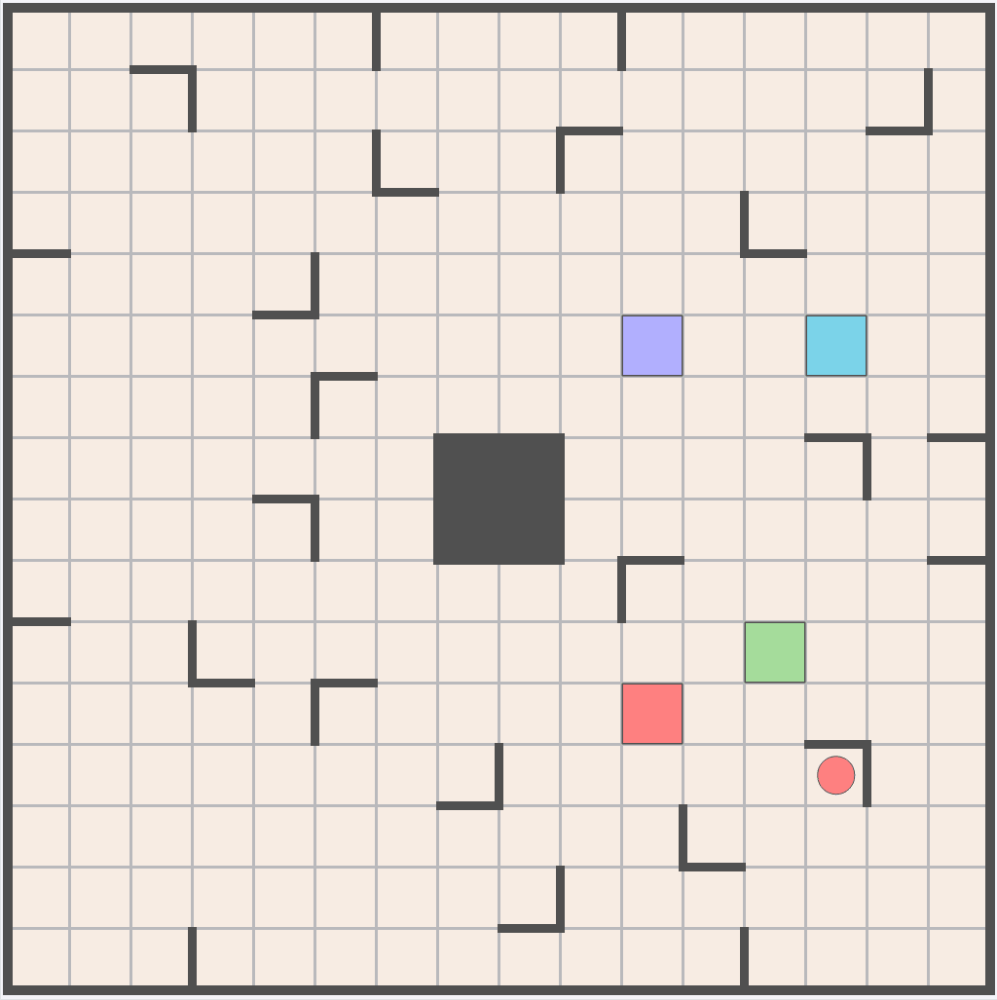

Racing Robots is a web application I build based on the puzzle board game "Ricochet Robots" designed by Alex Randolph and published by Rio Grande Games.

It is avilable live under https://rr-421.web.app/

The objective of the game is to bring the correct robot to the target using the fewest moves possible.

  

The game includes a solver that always finds the fastest possible way. The solver was not programmed by myself, it belongs to Kevin Cox (https://kevincox.ca/2023/09/02/ricochet-robots-solver/).
